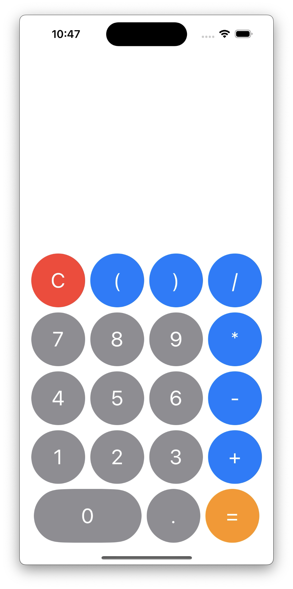

# iOS Calculator App



A simple calculator app for iOS, built with Swift and SwiftUI. This app allows users to perform basic arithmetic operations and view their calculation history in real-time.

## Features

- Perform basic arithmetic operations: addition, subtraction, multiplication, division
- Real-time display of input and operations
- Clear all inputs with the "C" button
- Calculation of results using Apple's NSExpression

## Requirements

- iOS 14.0 or later
- Xcode 12.0 or later

## Installation

1. Clone this repository:

    ```bash
    git clone [https://github.com/yourusername/ios-calculator-app.git](https://github.com/D0p3-CoRe/CalculatorApp-v1.02)
    ```

2. Open the project in Xcode:

    ```bash
    cd ios-calculator-app
    open CalculatorApp.xcodeproj
    ```

3. Build and run the app in the iOS Simulator or on a physical device.

## Usage

1. Launch the app on your iOS device or simulator.
2. Tap on the numbers and arithmetic operators to create a calculation.
3. Press "=" to get the result.
4. Use the "C" button to clear the current input and start over.

## Screenshots


*(Add your own screenshot of the app)*

## Contributing

Feel free to fork this repository and submit pull requests. For major changes, please open an issue first to discuss what you would like to change.

## License

This project is licensed under the MIT License - see the [LICENSE](LICENSE) file for details.
